# GCS Website Implementation Plan

> **Version**: 1.0 | **Status**: Pending Verification  
> **Target**: Autonomous agent execution without human intervention

---

## 1. System Architecture Overview

```mermaid
graph TD
    subgraph "Current State"
        A[index.html] --> B[styles.css]
        C[showcase.html] --> B
        C --> D[showcase.css]
        B --> E[Arrow_background.svg]
    end

    subgraph "Target State"
        A2[index.html] --> H[header partial]
        C2[showcase.html] --> H
        A2 --> B2[styles.css]
        C2 --> B2
        C2 --> D2[showcase.css - reduced]
        B2 --> E2[Arrow_background.svg]
        D2 -.->|inherits| B2
    end

    style A fill:#0077C8
    style C fill:#1b2838
    style A2 fill:#0077C8
    style C2 fill:#0077C8
```



### File Architecture

| File | Current Role | Target Role |
|------|--------------|-------------|
| [styles.css](file:///c:/00_Repos/Websites/GCS/css/styles.css) | Homepage styles + shared base | **Unified design system** |
| [showcase.css](file:///c:/00_Repos/Websites/GCS/css/showcase.css) | Standalone showcase theme | **Showcase-specific overrides only** |
| [Arrow_background.svg](file:///c:/00_Repos/Websites/GCS/assets/Arrow_background.svg) | Homepage pattern only | **Shared background asset** |

---

## 2. Design & UX Constraints

### 2.1 Background Specification

> [!IMPORTANT]
> The showcase page MUST use the identical background treatment as the homepage.

| Property | Value | Source |
|----------|-------|--------|
| Base Color | `#0077C8` (--color-primary) | [styles.css:3](file:///c:/00_Repos/Websites/GCS/css/styles.css#L3) |
| Pattern Asset | `Arrow_background.svg` | [assets/](file:///c:/00_Repos/Websites/GCS/assets/Arrow_background.svg) |
| Pattern Rotation | 45° (applied via `rotate(45 256 256)` in SVG) | SVG transform |
| Pattern Size | `140px` repeat | [styles.css:98](file:///c:/00_Repos/Websites/GCS/css/styles.css#L98) |
| Pattern Opacity | `0.15` | [styles.css:101](file:///c:/00_Repos/Websites/GCS/css/styles.css#L101) |

### 2.2 Color Consolidation

| Token | OLD Value | NEW Value | Applies To |
|-------|-----------|-----------|------------|
| `--showcase-bg` | `#1b2838` | `#0077C8` | Showcase body |
| `--showcase-accent` | `#66c0f4` | `#FFC700` | Showcase highlights |

### 2.3 Navigation Requirements

```
┌─────────────────────────────────────────────────────────────┐
│ [GCS LOGO]      HOME   SHOWCASE         [JOIN DISCORD]     │
└─────────────────────────────────────────────────────────────┘
```

- **Position**: Fixed top, full-width
- **Height**: 60px desktop / 50px mobile
- **Background**: Semi-transparent black `rgba(0,0,0,0.85)`
- **Links**: Barlow 500, uppercase, white

---

## 3. Task Breakdown

### Task 1: Unify Color Variables

| Attribute | Value |
|-----------|-------|
| **Purpose** | Consolidate showcase colors to match homepage palette |
| **Inputs** | `showcase.css` lines 1-10 |
| **Outputs** | Modified `:root` block in `showcase.css` |
| **Dependencies** | None |
| **Acceptance Criteria** | 1. `--showcase-bg` equals `var(--color-primary)` or `#0077C8` <br> 2. `--showcase-accent` equals `var(--color-accent)` or `#FFC700` <br> 3. No hardcoded `#1b2838` or `#66c0f4` remain in showcase.css |

**Implementation**:
```css
/* showcase.css - REPLACE lines 1-10 */
:root {
  --showcase-bg: var(--color-primary); /* #0077C8 from styles.css */
  --showcase-text: #FFFFFF;
  --showcase-accent: var(--color-accent); /* #FFC700 from styles.css */
}
```

---

### Task 2: Apply Arrow Background Pattern to Showcase

| Attribute | Value |
|-----------|-------|
| **Purpose** | Add 45° arrow pattern overlay to showcase body |
| **Inputs** | Homepage `.hero::before` pattern (styles.css:89-105) |
| **Outputs** | New `body::before` rule in `showcase.css` |
| **Dependencies** | Task 1 (colors must be unified first) |
| **Acceptance Criteria** | 1. Arrow pattern visible on showcase at 15% opacity <br> 2. Pattern size is 140px <br> 3. Pattern does not interfere with content (pointer-events: none) |

**Implementation**:
```css
/* showcase.css - ADD after body rule (line 10) */
body::before {
  content: '';
  position: fixed;
  top: 0;
  left: 0;
  width: 100%;
  height: 100%;
  background-image: url('../assets/Arrow_background.svg');
  background-size: 140px;
  background-repeat: repeat;
  opacity: 0.15;
  pointer-events: none;
  z-index: 0;
}

/* Ensure content sits above pattern */
main, footer {
  position: relative;
  z-index: 1;
}
```

---

### Task 3: Create Navigation Header Component

| Attribute | Value |
|-----------|-------|
| **Purpose** | Add persistent navigation across both pages |
| **Inputs** | Design spec from Section 2.3 |
| **Outputs** | 1. New `.site-header` CSS in `styles.css` <br> 2. Header HTML in `index.html` <br> 3. Header HTML in `showcase.html` |
| **Dependencies** | None (can run parallel with Tasks 1-2) |
| **Acceptance Criteria** | 1. Header visible on both pages <br> 2. "Home" link navigates to index.html <br> 3. "Showcase" link navigates to showcase.html <br> 4. "Join Discord" styled as accent button <br> 5. Header is fixed position, doesn't scroll |

**Implementation - CSS (styles.css)**:
```css
/* Add after line 71 (.container) */
.site-header {
  position: fixed;
  top: 0;
  left: 0;
  width: 100%;
  height: 60px;
  background: rgba(0, 0, 0, 0.85);
  backdrop-filter: blur(10px);
  display: flex;
  align-items: center;
  justify-content: space-between;
  padding: 0 2rem;
  z-index: 1000;
}

.site-header .logo-link {
  font-family: var(--font-heading);
  font-size: 1.5rem;
  color: var(--color-white);
}

.site-header nav {
  display: flex;
  align-items: center;
  gap: 2rem;
}

.site-header nav a {
  font-family: var(--font-body);
  font-weight: 500;
  font-size: 0.9rem;
  text-transform: uppercase;
  color: var(--color-white);
  letter-spacing: 1px;
  transition: color 0.2s;
}

.site-header nav a:hover {
  color: var(--color-accent);
}

.site-header .btn-nav {
  background: var(--color-accent);
  color: var(--color-black);
  padding: 0.5rem 1rem;
  border-radius: 4px;
  font-weight: 700;
}
```

**Implementation - HTML (both pages)**:
```html
<!-- Add immediately after <body> tag -->
<header class="site-header">
  <a href="index.html" class="logo-link">GCS</a>
  <nav>
    <a href="index.html">Home</a>
    <a href="showcase.html">Showcase</a>
    <a href="https://discord.gg/YpPJXkeW" class="btn-nav">Join Discord</a>
  </nav>
</header>
```

---

### Task 4: Adjust Page Layout for Fixed Header

| Attribute | Value |
|-----------|-------|
| **Purpose** | Prevent header from overlapping content |
| **Inputs** | Header height (60px) |
| **Outputs** | Updated `.hero` and `.showcase-hero` padding |
| **Dependencies** | Task 3 (header must exist) |
| **Acceptance Criteria** | 1. No content hidden behind header <br> 2. Hero sections start below header <br> 3. Smooth scroll offset accounts for header |

**Implementation**:
```css
/* styles.css - Modify .hero (line 74) */
.hero {
  /* existing properties... */
  padding-top: calc(60px + 2rem); /* Add header offset */
}

/* showcase.css - Modify .showcase-hero (line 16) */
.showcase-hero {
  /* existing properties... */
  padding-top: calc(60px + 2rem); /* Add header offset */
}

/* styles.css - Add scroll offset */
html {
  scroll-padding-top: 60px;
}
```

---

### Task 5: Add Footer to Homepage

| Attribute | Value |
|-----------|-------|
| **Purpose** | Ensure structural parity between pages |
| **Inputs** | Footer HTML from showcase.html (lines 194-206) |
| **Outputs** | Footer added to index.html |
| **Dependencies** | None |
| **Acceptance Criteria** | 1. Homepage displays footer <br> 2. Footer styling matches showcase <br> 3. Meeting info visible in yellow accent |

**Implementation**:
```html
<!-- index.html - Add before </main> closing tag -->
</section>

<footer>
  <div class="container">
    <div class="footer-content">
      <div class="footer-info">
        <h2>GAME CREATORS SPACE</h2>
        <p class="meeting-detail">MON @ 12PM | WB314</p>
      </div>
    </div>
    <div class="copyright">
      &copy; 2024 Game Creators Space. All rights reserved.
    </div>
  </div>
</footer>

</main>
```

---

### Task 6: Update Showcase Hero Info Panel Colors

| Attribute | Value |
|-----------|-------|
| **Purpose** | Adjust info panel to work with blue background |
| **Inputs** | `.hero-info-area` rule in showcase.css |
| **Outputs** | Updated gradient and border colors |
| **Dependencies** | Task 1 (colors unified) |
| **Acceptance Criteria** | 1. Info panel readable against blue <br> 2. Maintains visual hierarchy <br> 3. Border accent uses --color-accent |

**Implementation**:
```css
/* showcase.css - Modify .hero-info-area (line 70) */
.hero-info-area {
  flex: 3;
  padding: 2rem;
  display: flex;
  flex-direction: column;
  justify-content: center;
  background: linear-gradient(to right, rgba(0,0,0,0.7), rgba(0,0,0,0.5));
  border-left: 3px solid var(--showcase-accent);
  position: relative;
}
```

---

### Task 7: Mobile Header Responsiveness

| Attribute | Value |
|-----------|-------|
| **Purpose** | Ensure header works on mobile viewports |
| **Inputs** | Header CSS from Task 3 |
| **Outputs** | Mobile media query adjustments |
| **Dependencies** | Task 3 |
| **Acceptance Criteria** | 1. Header height 50px on mobile <br> 2. Nav links stack or use hamburger <br> 3. No horizontal overflow |

**Implementation**:
```css
/* styles.css - Add to @media (max-width: 768px) */
.site-header {
  height: 50px;
  padding: 0 1rem;
}

.site-header nav {
  gap: 1rem;
}

.site-header nav a:not(.btn-nav) {
  font-size: 0.8rem;
}

.site-header .btn-nav {
  padding: 0.4rem 0.8rem;
  font-size: 0.8rem;
}
```

---

## 4. Verification Report

### 4.1 Verification Agent Review

| Check | Status | Finding |
|-------|--------|---------|
| **Scope Creep** | ⚠️ | Task 3 (navigation) adds significant HTML to both pages. Consider extracting to partial if templating available. |
| **Dependency Chain** | ✅ | Tasks correctly ordered. Task 4 depends on Task 3. Tasks 1-2 can parallelize with Task 3. |
| **Missing Dependencies** | ⚠️ | No `scroll-behavior: smooth` found in base CSS. Add to ensure scroll offset works. |
| **Unclear Assumptions** | ⚠️ | Discord link uses `href="#"` - placeholder needs real URL before production. |
| **Color Override Conflict** | ✅ | `showcase.css` loads after `styles.css`, so variable overrides will cascade correctly. |
| **Z-Index Collision** | ✅ | Header z-index (1000) > arrow pattern z-index (0) > content z-index (1). No collision. |
| **Asset Path** | ✅ | Relative path `../assets/Arrow_background.svg` correct from `css/` directory. |

### 4.2 Proposed Fixes

| Issue | Fix | Applied To |
|-------|-----|------------|
| Missing scroll-behavior | Already exists in styles.css:27 (`scroll-behavior: smooth`) | N/A |
| Discord placeholder | Add comment for agent to skip or use `https://discord.gg/placeholder` | Task 3 |
| Header extraction | Out of scope for vanilla HTML site; acceptable duplication | N/A |

### 4.3 Risk Assessment

| Risk | Severity | Mitigation |
|------|----------|------------|
| Blue background reduces card contrast | Medium | Dark overlay on card images already exists |
| Arrow pattern on cards distracting | Low | `pointer-events: none` and z-index layering handles this |
| Mobile horizontal scroll with fixed header | Low | Tested in existing mobile breakpoint |

---

## 5. Final Approved Plan

> [!TIP]
> **Execution Order**: Tasks 1, 2, 5 can run in parallel. Task 3 runs independently. Task 4 waits for Task 3. Tasks 6, 7 run after their dependencies.

```mermaid
gantt
    title Execution Timeline
    dateFormat X
    axisFormat %s

    section Phase 1 - Parallel
    Task 1 - Unify Colors       :t1, 0, 1
    Task 2 - Arrow Background   :t2, 0, 1
    Task 3 - Navigation Header  :t3, 0, 2
    Task 5 - Homepage Footer    :t5, 0, 1

    section Phase 2 - Sequential
    Task 4 - Layout Offset      :t4, after t3, 1
    Task 6 - Info Panel Colors  :t6, after t1, 1
    Task 7 - Mobile Header      :t7, after t4, 1
```



### Execution Checklist

| # | Task | File(s) | Validation Command |
|---|------|---------|-------------------|
| 1 | Unify Colors | `showcase.css` | `grep -c "#1b2838\|#66c0f4" css/showcase.css` → expect `0` |
| 2 | Arrow Background | `showcase.css` | Visual: Arrow pattern visible at localhost:3000/showcase.html |
| 3 | Navigation Header | `styles.css`, `index.html`, `showcase.html` | DOM: `document.querySelector('.site-header')` exists on both pages |
| 4 | Layout Offset | `styles.css`, `showcase.css` | Visual: No content hidden behind header |
| 5 | Homepage Footer | `index.html` | DOM: `document.querySelector('footer')` exists |
| 6 | Info Panel | `showcase.css` | Visual: Info panel readable with new colors |
| 7 | Mobile Header | `styles.css` | Resize to 375px width, header fits without overflow |

---

## Verification Plan

### Automated Checks
```powershell
# Run from project root
# Check 1: No old colors remain
Select-String -Path "css/showcase.css" -Pattern "#1b2838|#66c0f4" | Measure-Object -Line

# Check 2: Header exists in both HTML files
Select-String -Path "*.html" -Pattern "site-header"

# Check 3: Footer exists in index.html
Select-String -Path "index.html" -Pattern "<footer>"
```

### Visual Verification (Browser)
1. Open `http://localhost:3000/` - verify header, arrow pattern absent (homepage keeps gradient)
2. Open `http://localhost:3000/showcase.html` - verify blue background with arrow pattern
3. Click "Home" in nav → navigates to index.html
4. Click "Showcase" in nav → navigates to showcase.html
5. Resize to 375px width → header and content fit correctly
6. Scroll showcase page → header stays fixed

---

## Appendix: Complete File Diffs

### showcase.css (Lines 1-30 replacement)

```diff
-:root {
-  --showcase-bg: #1b2838;
-  --showcase-text: #c7d5e0;
-  --showcase-accent: #66c0f4;
-}
+:root {
+  --showcase-bg: var(--color-primary);
+  --showcase-text: #FFFFFF;
+  --showcase-accent: var(--color-accent);
+}

 body {
   background-color: var(--showcase-bg);
   color: var(--showcase-text);
 }

+body::before {
+  content: '';
+  position: fixed;
+  top: 0;
+  left: 0;
+  width: 100%;
+  height: 100%;
+  background-image: url('../assets/Arrow_background.svg');
+  background-size: 140px;
+  background-repeat: repeat;
+  opacity: 0.15;
+  pointer-events: none;
+  z-index: 0;
+}
+
+main, footer {
+  position: relative;
+  z-index: 1;
+}
```

---

**Plan Status**: ✅ APPROVED FOR EXECUTION
