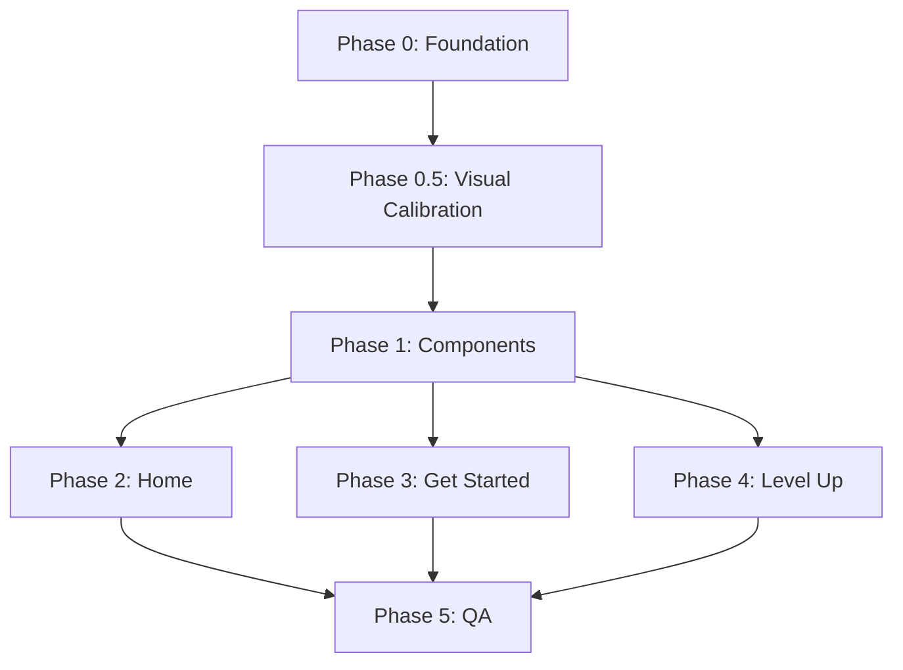

# GCS Website — Implementation Plan

**Version:** 1.1
**Date:** 2026-05-17
**Source:** `docs/website-specification.md` v1.3
**Status:** Ready for execution — visual-calibration pass added (Phase 0.5)

---

## Table of Contents

1. [Architecture Analysis](#1-architecture-analysis)
2. [Design System Translation](#2-design-system-translation)
3. [Layout Logic](#3-layout-logic)
4. [Execution Roadmap](#4-execution-roadmap)

---

## 1. Architecture Analysis

### 1.1 Current State Summary

| Page | File | Status | Lines | Key Issues |
|------|------|--------|-------|------------|
| Home | `index.html` | Exists (73 L) | Minimal | Missing lead paragraph, incorrect feature text, stale footer |
| Get Started | `get-started.html` | Exists (1048 L) | Heavy | Typos (§3 items 4–8), missing §4.3.1 downloads section, ~40 new tools to add |
| Level Up | `level-up.html` | Exists (135 L) | Functional | Missing sponsor callout (§4.4.1), incorrect body copy, stale footer |

### 1.2 Semantic HTML Target Structure

Each page must follow this landmark hierarchy:

```
<body>
  <header class="site-header">          <!-- role="banner" implicit -->
    <a class="logo-link">…</a>
    <nav aria-label="Main">…</nav>      <!-- role="navigation" implicit -->
  </header>
  <main>                                <!-- role="main" implicit -->
    <section class="hero" aria-label="…">
      <!-- page-specific hero content -->
    </section>
    <section id="…" aria-label="…">     <!-- content sections -->
    </section>
  </main>
  <footer>                              <!-- role="contentinfo" implicit -->
    <div class="container">
      <div class="footer-content">…</div>
      <nav class="footer-channels" aria-label="Social channels">…</nav>
      <p class="copyright">…</p>
    </div>
  </footer>
</body>
```

### 1.3 Gap Analysis — Spec vs. Current Code

#### Content Corrections (§3)

| # | File | Current | Required | Priority |
|---|------|---------|----------|----------|
| 2 | `index.html:39` | `GameJams` | `Game Jams` | P0 |
| 3 | `index.html:44` | `" get started"` | `"Get Started"` | P0 |
| 4 | `get-started.html:37` | `its about having fun` | `it's about having fun` | P0 |
| 5 | `get-started.html:39` | `assets resources` | `assets, resources,` | P0 |
| 6 | `get-started.html:67` | `many pro and cons` | `pros and cons to each engine.` | P0 |
| 7 | `get-started.html:68` | `which game best fits for you` | `which engine best fits your project.` | P0 |
| 8 | `get-started.html:214` | `peek under the hood` | `look under the hood eventually` | P1 |
| 9 | All footers | `Weekly meetings.` | Link to Ookslife + descriptive text | P0 |

#### Missing Structural Elements

| Element | Spec Reference | Affected Pages |
|---------|---------------|----------------|
| Lead paragraph below subtitle | §4.2 | `index.html` |
| Feature list with em-dash descriptions | §4.2 | `index.html` |
| `<nav class="footer-channels">` with 3 icon-links | §10.1 | All |
| OG/social `<meta>` tags | §11 item 1 | All |
| `prefers-reduced-motion` media query | §7 | All CSS |
| Templates & Guides download section | §4.3.1 | `get-started.html` |
| Sponsor inquiry callout | §4.4.1 | `level-up.html` |
| Volunteer mailto CTA | §4.4 | `level-up.html` |
| `--color-muted` variable | §2.1 | `css/styles.css` |
| `--color-blue-deep` variable | §2.1 | `css/styles.css` |
| Focus ring = yellow 2px (not blue 3px) | §7 | `css/styles.css` |

#### Visual-Reference Drift (NEW — from v1.3 spec audit)

These items are not "missing" — they exist in code but the current values diverge from the reference screenshots. Each must be corrected to match spec §2.5.

| Drift | Current code | Spec target (v1.3) | Affected |
|-------|--------------|--------------------|----------|
| Hero diagonal angle | `135deg` | `110deg` | `styles.css:137`, `level-up.css:13` |
| Hero diagonal stop | `60%` | `58%` | `styles.css:137`, `level-up.css:13` |
| Pattern tile size | `140px` | `200px` | `styles.css:155`, `level-up.css:32` |
| Pattern opacity | `0.15` | `0.22` | `styles.css:158`, `level-up.css:34` |
| `.tagline` not promoted | Inline class | Rename → `.eyebrow-pill` (and keep `.tagline` alias) | `styles.css:186`, all HTML |
| `.lu-hero__eyebrow` not generalized | Page-scoped | Promote to global `.eyebrow-text` | `level-up.css:59`, `styles.css` |
| Focus ring on hero | `--color-primary` 3 px | `--color-accent` 2 px globally | `styles.css:62` |

#### Level Up Page — Body Copy Delta

Current body copy is generic. Spec §4.4 requires:
- Eyebrow: `STUDENT GAME DEV CONFERENCE · EDMONTON`
- Revised body paragraph about conference specifics
- Features: Industry Booths / Panels & Q&A / One Day · Open to the Public
- Game jam disclaimer line
- Closing tagline: `Looking forward to seeing you next year.`

### 1.4 Toolset Addition Inventory

New tools to add to `get-started.html` (§5 additions marked **Add**):

| Section | Count | Tools |
|---------|-------|-------|
| §5.2 Specialized Engines | 5 | GameMaker, Defold, Bevy, Twine, Ren'Py |
| §5.3 Frameworks | 7 | LÖVE, Phaser 3, libGDX, pygame, SFML, SDL2, Box2D |
| §5.4 Code Editors | 3 | Visual Studio 2022, Cursor, Zed |
| §5.5 Version Control | 3 | GitHub+Git LFS, Plastic SCM, Perforce |
| §5.6 3D Modeling | 6 | Houdini, Marvelous Designer, Marmoset, SpeedTree, RizomUV, Cascadeur |
| §5.7 2D Art | 5 | Affinity Photo, Procreate, Clip Studio, Pixelorama, Libresprite, DragonBones |
| §5.8 Texturing | 3 | Substance Designer, ArmorPaint, Quixel Mixer |
| §5.9 Audio | 9 | Reaper, Ableton, FL Studio, LMMS, Bfxr, ChipTone, Cakewalk, FMOD, Wwise |
| §5.10 UI/UX | 3 | Penpot, Excalidraw, Miro |
| §5.11 Level Design | 1 | Trenchbroom |
| §5.12 Document & Tracking | 3 | Notion, Google Drive, Trello |
| §5.13 Asset Libraries | 4 | itch.io assets, Mixkit, Pixabay, GDC Vault |

**Total: ~51 new resource cards.**

---

## 2. Design System Translation

### 2.1 CSS Custom Properties

The `:root` block must be updated to include all spec tokens. Current state is missing `--color-muted` and spacing tokens.

```css
:root {
  /* === Colors (§2.1) === */
  --color-primary:    #0077C8;
  --color-accent:     #FFC700;
  --color-black:      #1A1A1A;
  --color-white:      #FFFFFF;
  --color-muted:      #6B7280;   /* NEW — secondary copy, meta text */
  --color-blue-deep:  #005A98;   /* NEW — pattern arrow fill on blue plane */
  --color-gray-light: #F4F4F4;

  /* === Typography (§2.2) === */
  --font-heading: 'Bebas Neue', sans-serif;
  --font-body:    'Barlow', sans-serif;

  /* === Fluid Type Ramp (§2.2) === */
  --fs-h1:    clamp(2.5rem, 7vw, 5.5rem);
  --fs-h2:    clamp(1.75rem, 4vw, 3rem);
  --fs-h3:    clamp(1.25rem, 2.5vw, 1.875rem);
  --fs-body:  1.05rem;
  --fs-small: 0.9rem;
  --fs-eyebrow: 0.85rem;

  /* === Spacing (§2.5) === */
  --space-section-y:  clamp(4rem, 6vw, 6rem);
  --space-section-x:  2rem;
  --space-card:       1.5rem;
  --space-gutter:     clamp(1.5rem, 2vw, 2rem);
  --header-height:    60px;

  /* === Layout (§2.5) === */
  --container-width:  90%;
  --container-max:    1200px;

  /* === Hero Composition (§2.5.1 / §2.5.2) === */
  --hero-angle:        110deg;   /* NEW — diagonal split (was 135deg) */
  --hero-split-pos:    58%;      /* NEW — color stop position (was 60%) */
  --pattern-tile:      200px;    /* NEW — arrow tile size (was 140px) */
  --pattern-opacity:   0.22;     /* NEW — pattern strength (was 0.15) */
}
```

### 2.2 Typography Rules

```css
h1 { font-size: var(--fs-h1); }
h2 { font-size: var(--fs-h2); }
h3 { font-size: var(--fs-h3); }
/* All headings: Bebas Neue, 400 weight, uppercase, line-height 1.1 — already correct */

/* Eyebrow/Caption pattern (§2.2) */
.eyebrow {
  font-family: var(--font-body);
  font-size: var(--fs-eyebrow);
  font-weight: 700;
  text-transform: uppercase;
  letter-spacing: 2px;
}
```

### 2.3 Component Tokens

| Component | Current | Spec Target | Delta |
|-----------|---------|-------------|-------|
| `.btn-primary` | White bg, dark text ✓ | 0.75rem × 1.5rem pad, 4px radius ✓ | Correct |
| `.btn-accent` | Yellow bg ✓ | Black text ✓ | Correct |
| `.btn-download` | Missing | `.btn-primary` + format/size label + `download` attr | **Create** |
| `.resource-card` | 1px border, 8px radius ✓ | Hover lifts 2px | Currently uses ring, **add translateY** |
| Badges (status) | Pill missing | 0.7rem, pill shape, 8 variants | **Refactor to pill** |
| `.eyebrow-pill` | Exists as `.tagline` | Bebas Neue, yellow pill, 1.1–1.25rem (§2.6) | **Rename + alias** — add `.eyebrow-pill` class, keep `.tagline` as alias to avoid churn |
| `.eyebrow-text` | Exists only as `.lu-hero__eyebrow` | Barlow 700, yellow, 0.85rem, 2px tracking (§2.6) | **Promote to global** |
| `.hero-quote` | Exists, inline | Same look, named component (§2.6) | **Add docs only** — already correct in CSS |
| `.feature-list--chevron` | Exists as `.lu-hero__features li::before` | Yellow `›` marker (§2.6) | **Promote to global** so home can adopt it if desired |
| Hero diagonal | `linear-gradient(135deg, … 60% …)` | `linear-gradient(110deg, … 58% …)` (§2.5.1) | **Recalibrate angle + stop** |
| Hero pattern | `200px` tile, `0.22` opacity | Same (§2.5.2) | **Raise from `140px` / `0.15`** |
| Focus ring | Blue 3px | Yellow 2px (§7) | **Fix** |
| Sponsor callout | Missing | Dark surface, yellow border-top | **Create** |
| Channel link | Missing | Icon + label pair | **Create** |
| Carousel strip | Exists in `level-up.css` | 60vh, full-bleed, bottom shadow (§2.6) | **Keep, no changes** |

### 2.4 Accessibility Fixes

```css
/* Fix: Focus ring must be yellow per §7 */
:focus-visible {
  outline: 2px solid var(--color-accent);
  outline-offset: 2px;
}

/* Fix: Respect reduced motion per §7 */
@media (prefers-reduced-motion: reduce) {
  *, *::before, *::after {
    animation-duration: 0.01ms !important;
    transition-duration: 0.01ms !important;
  }
}
```

---

## 3. Layout Logic

### 3.1 Breakpoint Strategy

Per §2.5, three breakpoints govern all layout shifts:

| Name | Query | Columns | Hero | Cards |
|------|-------|---------|------|-------|
| Mobile | `max-width: 480px` | 1 | Full-bleed, vertical stack | Single column |
| Tablet | `481px – 900px` | 1–2 | Single column hero, 2-up grid | 2-up |
| Desktop | `901px+` | 2–3 | Two-column hero, 3-up grid, diagonal split | 3-up |

**Current issue:** CSS uses `768px` and `1024px` breakpoints inconsistently. Normalize to `480px` / `900px` per spec.

### 3.2 Page-Level Layout Patterns

#### Home (`index.html`)

```
┌─────────────────────────────────┐
│ .site-header (fixed, 60px)      │
├─────────────────────────────────┤
│ .hero (100vh, diagonal gradient)│
│  ┌──────────┬──────────┐        │
│  │ .hero-   │ .hero-   │        │  ← Flexbox row, desktop
│  │ content  │ visual   │        │
│  └──────────┴──────────┘        │
│  Mobile: column, logo on top    │
├─────────────────────────────────┤
│ footer                          │
└─────────────────────────────────┘
```

#### Get Started (`get-started.html`)

```
┌─ header ────────────────────────┐
├─ .hero.guide-hero ──────────────┤
│  Flexbox row → column on mobile │
├─ #chapter-1 (.engine-grid) ─────┤
│  CSS Grid: 3col → 2col → 1col  │
│  + .resource-grid sub-sections  │
├─ #chapter-2 (.resource-grid) ───┤
│  auto-fit minmax(280px, 1fr)    │
├─ #chapter-3 (.resource-grid) ───┤
│  Same grid pattern              │
├─ §4.3.1 Downloads section ──────┤  ← NEW
│  .resource-card × 2             │
├─ footer ────────────────────────┤
└─────────────────────────────────┘
```

#### Level Up (`level-up.html`)

```
┌─ header ────────────────────────┐
├─ .lu-hero ──────────────────────┤
│  .lu-carousel (full-bleed)      │
│  .lu-hero__inner (grid 1fr auto)│
│   text col  |  badge            │
├─ §4.4.1 Sponsor Callout ───────┤  ← NEW
│  Dark surface, yellow top border│
│  .sponsor-callout               │
├─ footer ────────────────────────┤
└─────────────────────────────────┘
```

### 3.3 Grid Specifications

```css
/* Featured engines — explicit 3-col (§5.1) */
.engine-grid {
  display: grid;
  grid-template-columns: repeat(3, 1fr);
  gap: var(--space-gutter);
}

/* Resource cards — fluid auto-fit (§5.2–5.13) */
.resource-grid {
  display: grid;
  grid-template-columns: repeat(auto-fit, minmax(280px, 1fr));
  gap: var(--space-gutter);
}

/* Breakpoint overrides */
@media (max-width: 900px) {
  .engine-grid { grid-template-columns: repeat(2, 1fr); }
}
@media (max-width: 480px) {
  .engine-grid { grid-template-columns: 1fr; }
}
```

### 3.4 Hero Diagonal — Recalibrated Recipe (§2.5.1)

The v1.2 plan used `135deg` / `60%`. The v1.3 spec audit corrects this to `110deg` / `58%` so the split renders steeper, matching the visual reference. Drive both values from custom properties so they can be tuned in one place.

```css
/* Desktop: diagonal split — token-driven (§2.5.1) */
.hero,
.lu-hero {
  background: linear-gradient(
    var(--hero-angle),
    var(--color-primary) 0%,
    var(--color-primary) var(--hero-split-pos),
    var(--color-black)   var(--hero-split-pos),
    var(--color-black)   100%
  );
}

/* Tablet + Mobile: vertical 50/50 split (§2.5.1) */
@media (max-width: 900px) {
  .hero,
  .lu-hero {
    background: linear-gradient(
      180deg,
      var(--color-primary) 0%,
      var(--color-primary) 50%,
      var(--color-black)   50%,
      var(--color-black)   100%
    );
  }
}
```

**Why token-driven:** the angle and split position are the two most likely values to need a tweak after a real-world visual review on a 2K monitor. Keeping them as custom properties means tuning happens in `:root`, not in three separate selectors.

**Edge case to verify:** at very wide aspect ratios (≥ 21:9), a fixed-angle gradient shifts the split position visually. If the split needs to stay at exactly `~58%` of width regardless of aspect, swap the gradient for a `clip-path: polygon()` mask on a black overlay over a solid `--color-primary` background. Defer this work until a real ultrawide test shows the issue — do not pre-optimise.

### 3.5 Arrow Pattern Overlay (§2.5.2)

The pattern is a pseudo-element on the hero, sized and faded via tokens:

```css
.hero::before,
.lu-hero::before {
  content: '';
  position: absolute;
  inset: 0;
  background-image: url('../assets/Arrow_background.svg');
  background-size: var(--pattern-tile);   /* 200px */
  background-repeat: repeat;
  opacity: var(--pattern-opacity);        /* 0.22 */
  pointer-events: none;
  z-index: 1;
}
```

Keep the pattern *global* across the hero (covering both blue and black halves). The black plane visually mutes the pattern naturally because the arrows are dark blue on dark; the eye reads them only on the blue side. Do not mask the pattern with a second clip-path — the natural muting is part of the design's depth.

### 3.6 Hero Visual Anchoring CSS (§2.5.3)

The hero visual (logo or controllers) crosses the diagonal on `index.html` and `get-started.html`. Achieve this with negative `left` positioning on the `.hero-visual` flex item:

```css
.hero-visual {
  flex: 1;
  display: flex;
  justify-content: center;
  align-items: center;
  position: relative;
  left: -2rem;   /* Pull visual left so it overlaps the diagonal */
  z-index: 2;
}

.hero-logo,
.guide-hero-img {
  width: 110%;
  max-width: 550px;
  filter: drop-shadow(0 20px 40px rgba(0, 0, 0, 0.4));
}
```

For `level-up.html`, the badge sits fully on black — no negative offset needed. Keep `.lu-hero__badge` centered in its grid cell as it is today.

---

## 4. Execution Roadmap

### Phase 0 — Foundation & Cleanup
**Estimated effort: 1–2 hours**

| # | Task | Files | Spec Ref |
|---|------|-------|----------|
| 0.1 | Add `--color-muted`, `--color-blue-deep`, spacing tokens, fluid type variables to `:root` | `styles.css` | §2.1, §2.2, §2.5 |
| 0.2 | Fix focus ring: change from blue 3px to yellow 2px | `styles.css` | §7 |
| 0.3 | Add `@media (prefers-reduced-motion)` block | `styles.css` | §7 |
| 0.4 | Normalize breakpoints to 480px / 900px | `styles.css`, `level-up.css` | §2.5 |
| 0.5 | Apply `clamp()` type ramp to h1–h3 via variables | `styles.css` | §2.2 |
| 0.6 | Delete `css/showcase.css` and `js/showcase-rotation.js` (deprecated) | CSS, JS | §3 #12 |

### Phase 0.5 — Visual Calibration (NEW)
**Estimated effort: 1 hour**

These tasks bring the existing hero implementation into alignment with the v1.3 visual reference. They're isolated as a separate phase because they're high-leverage (touch every page) but tightly scoped (token swaps + two recipe rewrites). Do them before Phase 1 components so downstream work inherits the corrected look.

| # | Task | Files | Spec Ref |
|---|------|-------|----------|
| 0.5.1 | Add hero-composition tokens (`--hero-angle: 110deg`, `--hero-split-pos: 58%`, `--pattern-tile: 200px`, `--pattern-opacity: 0.22`) to `:root` | `styles.css` | §2.5.1, §2.5.2 |
| 0.5.2 | Rewrite `.hero` background to use the token-driven gradient recipe (§3.4) | `styles.css` | §2.5.1 |
| 0.5.3 | Rewrite `.lu-hero` background to use the same recipe (currently duplicates the wrong angle) | `level-up.css` | §2.5.1 |
| 0.5.4 | Rewrite `.hero::before` and `.lu-hero::before` pattern overlay to use `--pattern-tile` / `--pattern-opacity` | `styles.css`, `level-up.css` | §2.5.2 |
| 0.5.5 | Promote `.tagline` → `.eyebrow-pill` (add the new class, retain `.tagline` as an alias selector so existing HTML keeps working) | `styles.css` | §2.6 |
| 0.5.6 | Promote `.lu-hero__eyebrow` → `.eyebrow-text` (move to `styles.css`, leave the page-scoped class as alias) | `styles.css`, `level-up.css` | §2.6 |
| 0.5.7 | Visual QA: load all three pages at 1440 px and confirm the diagonal angle and pattern density read as a match for the reference screenshots in `referance/` | All HTML | §2.5 |

### Phase 1 — Global Components
**Estimated effort: 2–3 hours**

| # | Task | Files | Spec Ref |
|---|------|-------|----------|
| 1.1 | Create `.btn-download` component class | `styles.css` | §2.6 |
| 1.2 | Refactor badges to pill shape, add all 8 variants | `styles.css` | §2.6 |
| 1.3 | Create `.sponsor-callout` component | `styles.css` | §2.6, §4.4.1 |
| 1.4 | Create `.channel-link` component (icon + label) | `styles.css` | §2.6, §10 |
| 1.5 | Build canonical footer HTML partial (shared across 3 pages) | All HTML | §10.1–10.2 |
| 1.6 | Add `.resource-card:hover { transform: translateY(-2px) }` | `styles.css` | §2.6 |

### Phase 2 — Home Page (`index.html`)
**Estimated effort: 1–2 hours**

| # | Task | Spec Ref |
|---|------|----------|
| 2.1 | Fix `GameJams` → `Game Jams` | §3 #2 |
| 2.2 | Fix `" get started"` → `"Get Started"` | §3 #3 |
| 2.3 | Add lead paragraph below subtitle | §4.2 |
| 2.4 | Update feature list with em-dash descriptions | §4.2 |
| 2.5 | Update footer to canonical version (Ookslife link, 3 channels) | §10 |
| 2.6 | Add OG meta tags (`og:title`, `og:description`, `og:image`, `og:url`) | §11 |
| 2.7 | Add `aria-label` to hero section | §7 |

### Phase 3 — Get Started Page (`get-started.html`)
**Estimated effort: 6–8 hours** (largest page)

| # | Task | Spec Ref |
|---|------|----------|
| 3.1 | Fix all 5 typos/copy issues (§3 items 4–8) | §3 |
| 3.2 | Update chapter intro copy to match §4.3 | §4.3 |
| 3.3 | Add §5.2 new engines: GameMaker, Defold, Bevy, Twine, Ren'Py | §5.2 |
| 3.4 | Add §5.3 Frameworks section (7 tools, new subsection) | §5.3 |
| 3.5 | Add §5.4 new editors: VS 2022, Cursor, Zed, Antigravity | §5.4 |
| 3.6 | Add §5.5 new VCS: Git LFS callout, Plastic SCM, Perforce | §5.5 |
| 3.7 | Add §5.6 new 3D tools (6 additions) | §5.6 |
| 3.8 | Add §5.7 new 2D tools (5 additions) | §5.7 |
| 3.9 | Add §5.8 new texturing tools (3 additions) | §5.8 |
| 3.10 | Add §5.9 new audio tools (9 additions) | §5.9 |
| 3.11 | Add §5.10 new UI/UX tools (3 additions) | §5.10 |
| 3.12 | Add §5.11 Trenchbroom | §5.11 |
| 3.13 | Add §5.12 Document & Tracking section (3 tools, new section) | §5.12 |
| 3.14 | Add §5.13 new asset libraries (4 additions) | §5.13 |
| 3.15 | Build §4.3.1 Templates & Guides download section | §4.3.1 |
| 3.16 | Update footer to canonical version | §10 |
| 3.17 | Add OG meta tags | §11 |
| 3.18 | Fix stray `</div></section>` nesting errors near line 1029 | Code quality |

### Phase 4 — Level Up Page (`level-up.html`)
**Estimated effort: 2–3 hours**

| # | Task | Spec Ref |
|---|------|----------|
| 4.1 | Update eyebrow to `STUDENT GAME DEV CONFERENCE · EDMONTON` | §4.4 |
| 4.2 | Replace body paragraph with spec copy | §4.4 |
| 4.3 | Update feature list: Industry Booths / Panels & Q&A / One Day | §4.4 |
| 4.4 | Add game jam disclaimer line | §4.4 |
| 4.5 | Add Get Tickets + Volunteer CTAs | §4.4 |
| 4.6 | Build sponsor inquiry callout section (§4.4.1) | §4.4.1 |
| 4.7 | Add `prefers-reduced-motion` check to `js/level-up.js` | §7 |
| 4.8 | Update footer to canonical version | §10 |
| 4.9 | Add OG meta tags | §11 |

### Phase 5 — Polish & QA
**Estimated effort: 2–3 hours**

| # | Task | Spec Ref |
|---|------|-------|
| 5.1 | Validate all `` have `width`/`height` and `loading` attributes | §8 CLS |
| 5.2 | Verify hero images use `<link rel="preload">` | §8 LCP |
| 5.3 | Run WCAG contrast check on all text/background combos | §7 |
| 5.4 | Keyboard-test all interactive elements (Tab order, focus rings) | §7 |
| 5.5 | Verify total page weight < 1.5 MB per page | §8 |
| 5.6 | Verify JS < 10 KB minified per page | §8 |
| 5.7 | Test at 480px, 900px, and 1200px+ viewports | §2.5 |
| 5.8 | Delete `z_old/` directory permanently | §3 #12 |
| 5.9 | Validate HTML with W3C validator (all 3 pages) | Best practice |
| 5.10 | Cross-browser test: Chrome, Firefox, Safari, Edge | Best practice |

---

## Dependency Graph



**Phases 2, 3, and 4 can be executed in parallel** after Phase 1 completes. Phase 5 requires all pages to be finished. Phase 0.5 must precede Phase 1 so that all components inherit the recalibrated hero tokens.

---

## File Impact Summary

| File | Action | Phase |
|------|--------|-------|
| `css/styles.css` | Heavy edits — tokens, components, breakpoints | 0, 1 |
| `css/level-up.css` | Breakpoint normalization, sponsor callout | 0, 4 |
| `css/showcase.css` | **Delete** | 0 |
| `js/showcase-rotation.js` | **Delete** | 0 |
| `index.html` | Content + footer + meta | 2 |
| `get-started.html` | Content + 51 new cards + downloads + footer | 3 |
| `level-up.html` | Content + sponsor section + footer | 4 |
| `js/level-up.js` | Add reduced-motion check | 4 |

---

## Estimated Total Effort

| Phase | Hours |
|-------|-------|
| 0 — Foundation | 1–2 |
| 0.5 — Visual Calibration | 1 |
| 1 — Components | 2–3 |
| 2 — Home | 1–2 |
| 3 — Get Started | 6–8 |
| 4 — Level Up | 2–3 |
| 5 — QA | 2–3 |
| **Total** | **15–22 hours** |

---

## Change Log

### Version 1.1 — 2026-05-17

**Synced to spec v1.3 (visual reference audit)**

- Added §1.3 "Visual-Reference Drift" table — captures the seven measured deltas between current CSS and the recalibrated v1.3 spec (diagonal angle, stop position, pattern size, pattern opacity, eyebrow class promotions, focus ring).
- Updated §2.1 `:root` token block: added `--color-blue-deep`, `--hero-angle`, `--hero-split-pos`, `--pattern-tile`, `--pattern-opacity`.
- Expanded §2.3 Component Tokens with five new rows: `.eyebrow-pill`, `.eyebrow-text`, `.hero-quote`, `.feature-list--chevron`, `Carousel strip`. Plus two recalibration rows for the hero diagonal and pattern.
- Rewrote §3.4 to use token-driven gradient at `110deg` / `58%` (was `135deg` / `60%`).
- Added §3.5 Arrow Pattern Overlay recipe.
- Added §3.6 Hero Visual Anchoring CSS.
- Added **Phase 0.5 — Visual Calibration** (7 tasks, ~1 hour) between Phase 0 and Phase 1 in the execution roadmap. Updated dependency graph and effort total accordingly.

### Version 1.0 — 2026-05-17

Initial plan, synced to spec v1.2.

---

*End of implementation plan. Execute phases sequentially (0 → 0.5 → 1 → 2/3/4 parallel → 5).*
